# Introduction

### Competition: [Titanic Kaggle](https://www.kaggle.com/c/titanic/overview)

This is notebook contains a simple data science project framework, for learning and portfolio construction purposes.

# Libs


```python
import numpy as np # linear algebra
import pandas as pd # data processing, CSV file I/O (e.g. pd.read_csv)
import seaborn as sns
import os

import tensorflow as tf
from tensorflow.keras import layers
from tensorflow.keras.layers import Input, Dense, BatchNormalization, Dropout, Embedding,  Flatten
from tensorflow.keras.models import Model, Sequential
from tensorflow.keras.callbacks import ReduceLROnPlateau, EarlyStopping
from tensorflow.keras.optimizers import RMSprop
from tensorflow.data import Dataset
from tensorflow import keras

from sklearn.model_selection import train_test_split, KFold, GridSearchCV, cross_val_score
from sklearn.preprocessing import QuantileTransformer,  KBinsDiscretizer, MinMaxScaler
from sklearn.impute import SimpleImputer
from sklearn.pipeline import Pipeline
from sklearn import metrics

import matplotlib.pyplot as plt

import optuna
from optuna.visualization import plot_contour, plot_edf, plot_intermediate_values, plot_optimization_history
from optuna.visualization import plot_parallel_coordinate, plot_param_importances, plot_slice
```

### Models


```python
from sklearn.linear_model import LogisticRegression
from sklearn.linear_model import ElasticNet
from sklearn.svm import SVC
from sklearn.ensemble import RandomForestClassifier
from sklearn.linear_model import LinearRegression
```

# Load Dataset

This step we simply get our data to our working environment. Because we are not dealing with live data, a simple pandas usage is enough.


```python
%%time

train = pd.read_csv("data/train.csv")
test = pd.read_csv("data/test.csv")
```

    Wall time: 15.3 ms


# Exploratory Data Analysis


```python
train.head()
```


<div>
<style scoped>
    .dataframe tbody tr th:only-of-type {
        vertical-align: middle;
    }

    .dataframe tbody tr th {
        vertical-align: top;
    }

    .dataframe thead th {
        text-align: right;
    }
</style>
<table border="1" class="dataframe">
  <thead>
    <tr style="text-align: right;">
      <th></th>
      <th>PassengerId</th>
      <th>Survived</th>
      <th>Pclass</th>
      <th>Name</th>
      <th>Sex</th>
      <th>Age</th>
      <th>SibSp</th>
      <th>Parch</th>
      <th>Ticket</th>
      <th>Fare</th>
      <th>Cabin</th>
      <th>Embarked</th>
    </tr>
  </thead>
  <tbody>
    <tr>
      <th>0</th>
      <td>1</td>
      <td>0</td>
      <td>3</td>
      <td>Braund, Mr. Owen Harris</td>
      <td>male</td>
      <td>22.0</td>
      <td>1</td>
      <td>0</td>
      <td>A/5 21171</td>
      <td>7.2500</td>
      <td>NaN</td>
      <td>S</td>
    </tr>
    <tr>
      <th>1</th>
      <td>2</td>
      <td>1</td>
      <td>1</td>
      <td>Cumings, Mrs. John Bradley (Florence Briggs Th...</td>
      <td>female</td>
      <td>38.0</td>
      <td>1</td>
      <td>0</td>
      <td>PC 17599</td>
      <td>71.2833</td>
      <td>C85</td>
      <td>C</td>
    </tr>
    <tr>
      <th>2</th>
      <td>3</td>
      <td>1</td>
      <td>3</td>
      <td>Heikkinen, Miss. Laina</td>
      <td>female</td>
      <td>26.0</td>
      <td>0</td>
      <td>0</td>
      <td>STON/O2. 3101282</td>
      <td>7.9250</td>
      <td>NaN</td>
      <td>S</td>
    </tr>
    <tr>
      <th>3</th>
      <td>4</td>
      <td>1</td>
      <td>1</td>
      <td>Futrelle, Mrs. Jacques Heath (Lily May Peel)</td>
      <td>female</td>
      <td>35.0</td>
      <td>1</td>
      <td>0</td>
      <td>113803</td>
      <td>53.1000</td>
      <td>C123</td>
      <td>S</td>
    </tr>
    <tr>
      <th>4</th>
      <td>5</td>
      <td>0</td>
      <td>3</td>
      <td>Allen, Mr. William Henry</td>
      <td>male</td>
      <td>35.0</td>
      <td>0</td>
      <td>0</td>
      <td>373450</td>
      <td>8.0500</td>
      <td>NaN</td>
      <td>S</td>
    </tr>
  </tbody>
</table>
</div>


### Checking if Pclass has any effect on survival rate


```python
sns.barplot(x="Pclass", y="Survived", data=train);
```


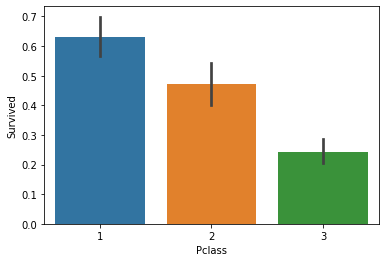


Here we can see that Pclass is an important variable

### Checking Sex and Embarked


```python
sns.barplot(x="Sex", y="Survived", data=train);
```


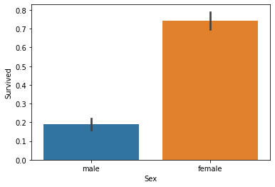


```python
sns.barplot(x="Embarked", y="Survived", data=train);
```


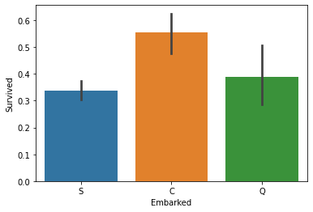


We can see that the survival rate between females and males are most discrepant, and the *Embarked* variable has some effect as well.

- [x] Pclass
- [ ] Name
- [x] Sex
- [ ] Age
- [ ] SibSp
- [ ] Parch
- [ ] Ticket
- [ ] Fare
- [ ] Cabin
- [x] Embarked

## Let's verify the rest of categorical variables (Cabin, Name, Ticket)

### First, the Cabin variable


```python
sns.barplot(x="Cabin", y="Survived", data=train);
```


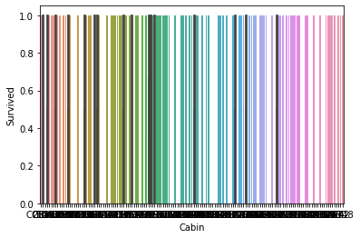


We can't really use it this way, so let's change it a little:
Let's test three hipothesis:
- The letter is important;
- The number is important;
- Having it as missing or not is important.


```python
train.loc[train['Cabin'].isna(), 'Cabin'] = 'missing'
cabin_letters = [s[0] for s in train['Cabin']]
```


```python
sns.barplot(x= cabin_letters, y=train["Survived"]);
```


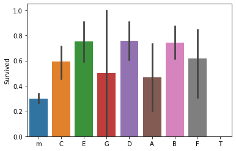


Here we can see that the missing values don't really tell us anything, as it's mean is around the overall survival rate.

Overall, most of the error bars are too big for us to consider that the letter has anything to do with the survival rate. However, we will consider the C, E, D, B letters as they are statiscally different than the overall mean.

Before moving on, let's see if we can embed them in one variable.


```python
train['Cabin_CEDB'] = np.array([letter[0] in ['C', 'E', 'D', 'B'] for letter in train['Cabin']]).astype(int)
sns.barplot(x = train['Cabin_CEDB'], y = train["Survived"]);
```


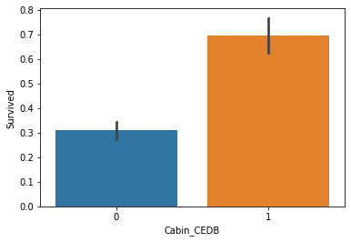


Is the cabin number important?


```python
cabin_numbers = [s.split()[0][1:] for s in train['Cabin']]
for i in range(len(cabin_numbers)):
    try:
        cabin_numbers[i] = int(cabin_numbers[i])
    except Exception:
        cabin_numbers[i] = np.nan
```


```python
sns.boxplot(x = train["Survived"], y = cabin_numbers);
```


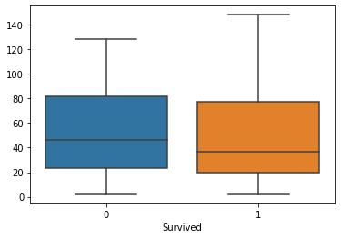


With this we can conclude that the number is not relevant!
- [x] The letter is important (**Important**);
- [x] The number is important (**Not Important**);
- [x] Having it as missing or not is important (**Not Important**).

### Next, the *Name* variable


```python
len(train['Name'].unique())
```


    891


Here we can see that every name here is unique, so we have to transform it a bit.

The hipothesis tested is that the title of each name is relevant to predict the survival rate.


```python
name_and_title = [name.split(", ")[1] for name in train['Name']]
title = [name.split(".")[0] for name in name_and_title]
print(len(title))
```

    891


```python
print(len(np.unique(title)))
np.unique(title)
```

    17


    array(['Capt', 'Col', 'Don', 'Dr', 'Jonkheer', 'Lady', 'Major', 'Master',
           'Miss', 'Mlle', 'Mme', 'Mr', 'Mrs', 'Ms', 'Rev', 'Sir',
           'the Countess'], dtype='<U12')


```python
pd.Series(title).value_counts()
```


    Mr              517
    Miss            182
    Mrs             125
    Master           40
    Dr                7
    Rev               6
    Col               2
    Major             2
    Mlle              2
    Lady              1
    the Countess      1
    Don               1
    Ms                1
    Sir               1
    Jonkheer          1
    Capt              1
    Mme               1
    dtype: int64


Let's only consider the titles: Mr, Miss, Mrs and Master; as we don't have enough observations from the others


```python
for i in range(len(title)):
    if title[i] not in ['Mr', 'Miss', 'Mrs', 'Master']:
        title[i] = 'Other'        
```


```python
train['Name'] = title
sns.barplot(x = title, y = train["Survived"]);
```


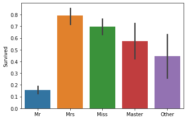


The *Mrs* title is relevant, however it is probably highly correlated with the *Sex* variable.

Something intereting is the relevancy of the *Master* title, that probably has information about the economical power of the person.

### Lastly, the Ticket variable


```python
train['Ticket']
```


    0             A/5 21171
    1              PC 17599
    2      STON/O2. 3101282
    3                113803
    4                373450
                 ...       
    886              211536
    887              112053
    888          W./C. 6607
    889              111369
    890              370376
    Name: Ticket, Length: 891, dtype: object


Here we will test only one hipothesis:
- The letters have relevant information


```python
tickets = [s.split()[0] for s in train['Ticket']]
for i in range(len(tickets)):
    try:
        int(tickets[i])
        tickets[i] = "number"
    except:
        tickets[i] = "Letter"
```


```python
sns.barplot(x = tickets, y = train["Survived"]);
```


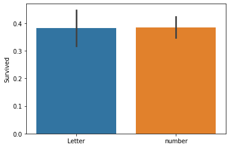


We can conclude here that the letter in the ticket variable most likely has not any relevant information.

- [x] Pclass
- [x] Name
- [x] Sex
- [ ] Age
- [ ] SibSp
- [ ] Parch
- [x] Ticket
- [ ] Fare
- [x] Cabin
- [x] Embarked

## Now, for the numerical variables (*Age*,	*SibSp*, *Parch*, *Fare*)

### Age


```python
sns.boxplot(x = train["Survived"], y = train['Age']);
```


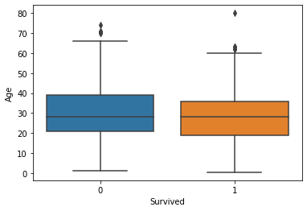


It looks like the average age does not differ when comparing the survived and not survived people.

### SibSp


```python
sns.barplot(x = train['SibSp'], y = train["Survived"]);
```


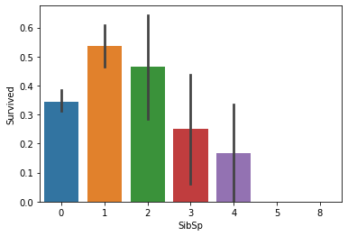


Only when SibSp = 1 that we have a relevant information.


```python
train['SibSp_1'] = (train['SibSp'] == 1).astype(int)
sns.barplot(x = train['SibSp_1'], y = train["Survived"]);
```


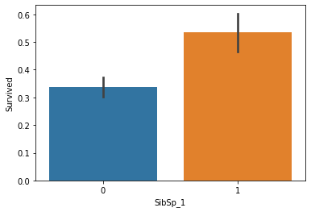


### Parch


```python
sns.barplot(x = train['Parch'], y = train["Survived"]);
```


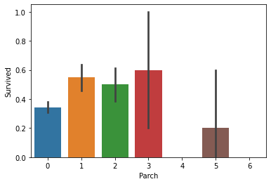


We can have better predictions when Parch = 1 or 2


```python
train['Parch_1_or_2'] = np.logical_or(train['Parch'] == 1, train['Parch'] == 2).astype(int)
sns.barplot(x = np.logical_or(train['Parch'] == 1, train['Parch'] == 2), y = train["Survived"]);
```


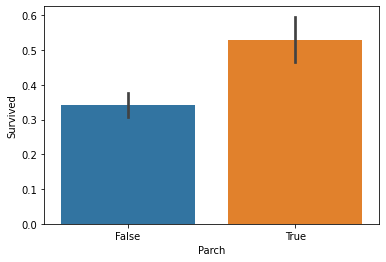


### Parch + SibSp


```python
sns.barplot(x = train['Parch_1_or_2'], y = train["Survived"]);
```


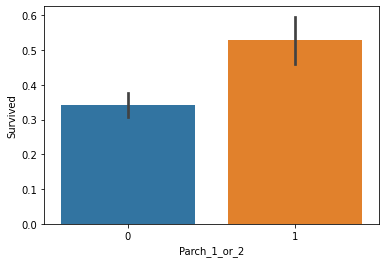


Here we can see that from 4 Parch + SipSp, the survival rate decreases, so we will create a dummy variable for <4 relatives.


```python
train['Parch_SibSp_lt_4'] = ((train['Parch'] + train['SibSp']) < 4).astype(int)
sns.barplot(x = train['Parch_SibSp_lt_4'], y = train["Survived"]);
```


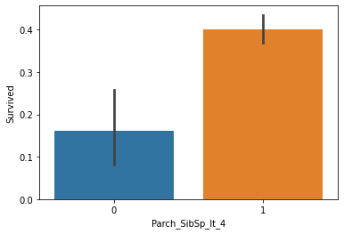


### Fare


```python
sns.histplot(multiple = 'dodge', x = train['Fare'], hue = train["Survived"], bins = 7);
```


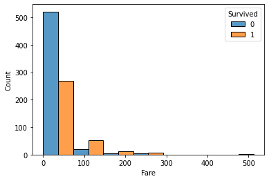


Higher fares -> higher survival rates

- [x] Pclass
- [x] Name
- [x] Sex
- [x] Age
- [x] SibSp
- [x] Parch
- [x] Ticket
- [x] Fare
- [x] Cabin
- [x] Embarked

# Variable Selection
Using the EDA's results, the variable selection step will be manual.
For our model, we will initially use the variables:
* Pclass
* Sex
* Embarked
* Cabin (Dummy for when C, E, D or B)
* Name (Mr, Mrs, Miss, Master)
* SibSp (when equals 1)
* Parch (when equals 1 or 2)
* SibSp + Parch (when equals 4 or less)
* Fare

# Preprocessing

## Dealing with *Missings*


```python
import missingno as msno
msno.matrix(train);
```


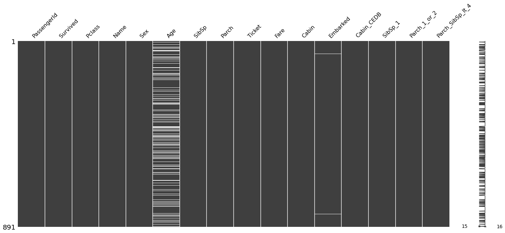


We will use the mode value for the Embarked variable. As the Age variable will not be used, we will not treat it.


```python
train.loc[train.isna()['Embarked'],:]
```


<div>
<style scoped>
    .dataframe tbody tr th:only-of-type {
        vertical-align: middle;
    }

    .dataframe tbody tr th {
        vertical-align: top;
    }

    .dataframe thead th {
        text-align: right;
    }
</style>
<table border="1" class="dataframe">
  <thead>
    <tr style="text-align: right;">
      <th></th>
      <th>PassengerId</th>
      <th>Survived</th>
      <th>Pclass</th>
      <th>Name</th>
      <th>Sex</th>
      <th>Age</th>
      <th>SibSp</th>
      <th>Parch</th>
      <th>Ticket</th>
      <th>Fare</th>
      <th>Cabin</th>
      <th>Embarked</th>
      <th>Cabin_CEDB</th>
      <th>SibSp_1</th>
      <th>Parch_1_or_2</th>
      <th>Parch_SibSp_lt_4</th>
    </tr>
  </thead>
  <tbody>
    <tr>
      <th>61</th>
      <td>62</td>
      <td>1</td>
      <td>1</td>
      <td>Miss</td>
      <td>female</td>
      <td>38.0</td>
      <td>0</td>
      <td>0</td>
      <td>113572</td>
      <td>80.0</td>
      <td>B28</td>
      <td>NaN</td>
      <td>1</td>
      <td>0</td>
      <td>0</td>
      <td>1</td>
    </tr>
    <tr>
      <th>829</th>
      <td>830</td>
      <td>1</td>
      <td>1</td>
      <td>Mrs</td>
      <td>female</td>
      <td>62.0</td>
      <td>0</td>
      <td>0</td>
      <td>113572</td>
      <td>80.0</td>
      <td>B28</td>
      <td>NaN</td>
      <td>1</td>
      <td>0</td>
      <td>0</td>
      <td>1</td>
    </tr>
  </tbody>
</table>
</div>


```python
train['Embarked'].fillna(train['Embarked'].mode()[0], inplace=True)
```

## One-hot Encoding


```python
train = pd.get_dummies(train,
    columns = ['Pclass', 'Sex', 'Embarked'])
```


```python
train = pd.concat([train, pd.get_dummies(train['Name']).filter(['Miss', 'Mr', 'Mrs', 'Master'])], axis = 1)
train.drop(['Name', 'PassengerId', 'Age', 'Ticket', 'Parch', 'SibSp', 'Cabin'], axis = 1, inplace = True)

features = [feature for feature in train.columns if feature not in ['PassengerID', 'Survived']]
```

## Scaling Fare variable


```python
scl = MinMaxScaler()
train['Fare'] = scl.fit_transform(train[['Fare']])
```

# Simple Logistic Regression
Here a logistic regression model will be tested in a two-fold cross validation accuracy scoring.

Here the KFold's k used will be two, se we can generalize more in this low sample problem.


```python
log = LogisticRegression()

kf = KFold(2, shuffle = True, random_state = 0)

accuracy_scores = []
for train_ix, test_ix in kf.split(train):
    log.fit(train.loc[train_ix, features], train.loc[train_ix, 'Survived'])
    preds = log.predict(train.loc[test_ix, features])

    accuracy_scores.append(metrics.accuracy_score(train.loc[test_ix, 'Survived'], preds))

print(np.mean(accuracy_scores))
```

    0.8237945281402731


# Applying all previous steps to the test dataset


```python
test.loc[test['Cabin'].isna(), 'Cabin'] = 'missing'

cabin_letters = [s[0] for s in test['Cabin']]
test['Cabin_CEDB'] = np.array([letter[0] in ['C', 'E', 'D', 'B'] for letter in test['Cabin']]).astype(int)

name_and_title = [name.split(", ")[1] for name in test['Name']]
title = [name.split(".")[0] for name in name_and_title]
for i in range(len(title)):
    if title[i] not in ['Mr', 'Miss', 'Mrs', 'Master']:
        title[i] = 'Other'
test['Name'] = title

test['SibSp_1'] = (test['SibSp'] == 1).astype(int)
test['Parch_1_or_2'] = np.logical_or(test['Parch'] == 1, test['Parch'] == 2).astype(int)
test['Parch_SibSp_lt_4'] = ((test['Parch'] + test['SibSp']) < 4).astype(int)

test = pd.get_dummies(test, columns = ['Pclass', 'Sex', 'Embarked'])
test = pd.concat([test, pd.get_dummies(test['Name']).filter(['Miss', 'Mr', 'Mrs', 'Master'])], axis = 1)
```


```python
msno.matrix(test);
```


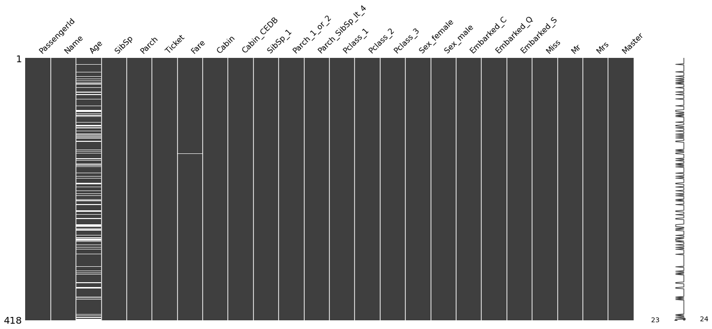


```python
test['Fare'].fillna(test['Fare'].mean(), inplace=True)
test['Fare'] = scl.transform(test[['Fare']])
```


```python
log.fit(train[features], train['Survived'])
preds = log.predict(test[features])
```

### Predictions on test dataset


```python
submission = pd.read_csv('data/submission.csv')
submission['Survived'] = preds
submission.to_csv("data/submission.csv", index = False)
```

Submitting this prediction gives us an accuracy of 76.076%. As we know that the accuracy metric is highly sensitive to your defined threshold, we could manually change it's value to improve the accuracy model.


```python
submission['Survived'] = (pd.DataFrame(preds)[0] < 0.3).astype(int)
submission.to_csv("data/submission.csv", index = False)
```

If we use the 0.3 threshold, we have an accuracy of 79.425%. That's significantly better than our previous result, however it is not exactly fair, as it was tuned using the submission's results directly.

We can do a similar approach tuning the threshold value using our train data:


```python
from sklearn.metrics import accuracy_score

kf = KFold(2, shuffle = True, random_state = 0)

outer_scores = []

for i in range(0, 101):
    inner_scores = []
    for train_ix, test_ix in kf.split(train):
        log.fit(train.loc[train_ix, features], train.loc[train_ix, 'Survived'])
        preds = log.predict_proba(train.loc[test_ix, features])

        inner_scores.append(metrics.accuracy_score((pd.DataFrame(preds)[0] < i/100).astype(int),
                           train.loc[test_ix, 'Survived']))

    outer_scores.append(np.mean(inner_scores))    
```


```python
pd.DataFrame(outer_scores).plot();
```


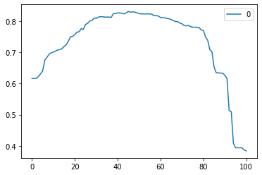


```python
print(max(outer_scores), outer_scores.index(max(outer_scores)))
```

    0.8305310626291127 45


Here the max accuracy value occurs when the threshold value is equal to 0.46 with an validation accuracy of 83.05%.


```python
log.fit(train[features], train['Survived'])
preds = log.predict_proba(test[features])

submission['Survived'] = (pd.DataFrame(preds)[0] < 0.46).astype(int)
submission.to_csv("data/submission.csv", index = False)
```

Submitting this predictions gives us a score of 77.511%, better than our initial submission.

# Clustering
Something that often helps when trying to maximize your prediction scores, is using a cluster variable.


```python
from sklearn.cluster import KMeans

outer_scores = []
for i in range(1, 10, 1):
    kf = KFold(2, shuffle = True, random_state = 0)

    kmeans = KMeans(n_clusters = i, random_state = 0)
    kmeans.fit(train[features])

    train_cluster = pd.DataFrame(kmeans.labels_, columns = ['cluster'])
    train_cluster = pd.get_dummies(train_cluster.astype(str))

    temp_features = pd.DataFrame(pd.concat([train[features], train_cluster], axis = 1))

    accuracy_scores = []
    for train_ix, test_ix in kf.split(temp_features):
        log.fit(temp_features.loc[train_ix], train.loc[train_ix, 'Survived'])
        preds = log.predict(temp_features.loc[test_ix])

        accuracy_scores.append(metrics.accuracy_score(train.loc[test_ix, 'Survived'], preds))

    outer_scores.append(np.mean(accuracy_scores))
```


```python
pd.DataFrame(outer_scores).plot();
```


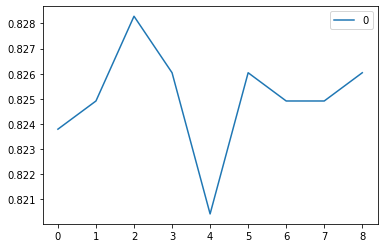


```python
print(max(outer_scores), outer_scores.index(max(outer_scores)))
```

    0.8282863908903109 2


This means that we can have better predictions when incluting clusters variables in the model.

Here, a k = 2 in the KMeans algorithmn gives us a performance of 82.83%. Better than our previous model.


```python
kmeans = KMeans(n_clusters = 2, random_state = 0)
kmeans.fit(train[features])

train_cluster = pd.DataFrame(kmeans.labels_, columns = ['cluster'])
train_cluster = pd.get_dummies(train_cluster.astype(str))

test_cluster = pd.DataFrame(kmeans.predict(test[features]), columns = ['cluster'])
test_cluster = pd.get_dummies(test_cluster.astype(str))

train = pd.DataFrame(pd.concat([train, train_cluster], axis = 1))
test = pd.DataFrame(pd.concat([test, test_cluster], axis = 1))

features = [f for f in train.columns if f not in ['Survived', 'PassengerId']]
```

# Finding a better model
After treating our data and feature engineering, the focus now is getting a better model. We can start using several models without too much tuning to discover which ones are the most promising, then we work on those ones. The 0.5 threshold will be used initially as some models return different concepts when using the *predict_proba* method.

## Linear Regression


```python
log = LinearRegression()

kf = KFold(2, shuffle = True, random_state = 0)

accuracy_scores = []
for train_ix, test_ix in kf.split(train):
    log.fit(train.loc[train_ix, features], train.loc[train_ix, 'Survived'])
    preds = log.predict(train.loc[test_ix, features])
    preds = (preds > 0.5).astype(int)

    accuracy_scores.append(metrics.accuracy_score(train.loc[test_ix, 'Survived'], preds))

print(np.mean(accuracy_scores))
```

    0.8294099863959289


## RandomForestClassifier


```python
optuna.logging.set_verbosity(optuna.logging.WARNING)

def objective(trial):

    model = RandomForestClassifier(
        n_estimators = trial.suggest_int('n_estimators', 10, 250),
        max_depth = trial.suggest_int('max_depth', 3, 12),
        max_features = trial.suggest_int('max_features', 1, 17),
        random_state = 0
    )

    kf = KFold(2, shuffle = True, random_state = 0)
    kf.split(train)

    accuracy_scores = []

    for train_ix, test_ix in kf.split(train):
        model.fit(train.loc[train_ix, features], train.loc[train_ix, 'Survived'])
        preds = model.predict_proba(train.loc[test_ix, features])[:,0]
        preds = (pd.DataFrame(preds) < 0.46).astype(int)


        accuracy_scores.append(metrics.accuracy_score(train.loc[test_ix, 'Survived'], preds))

    return np.mean(accuracy_scores)


# 3. Create a study object and optimize the objective function.

study = optuna.create_study(direction='maximize')
study.optimize(objective, n_trials=250)
```


```python
print(study.best_trial.values)
study.best_params
```

    [0.8428654204665693]


    {'n_estimators': 162, 'max_depth': 7, 'max_features': 8}


## SVC


```python
def objective(trial):

    model = SVC(
        C = trial.suggest_float('C', 1e-6, 10),
        kernel = trial.suggest_categorical('kernel', ['linear', 'poly', 'rbf', 'sigmoid'])
    )

    kf = KFold(2, shuffle = True, random_state = 0)
    kf.split(train)

    accuracy_scores = []

    for train_ix, test_ix in kf.split(train):
        model.fit(train.loc[train_ix, features], train.loc[train_ix, 'Survived'])
        preds = model.predict(train.loc[test_ix, features])

        accuracy_scores.append(metrics.accuracy_score(train.loc[test_ix, 'Survived'], preds))

    return np.mean(accuracy_scores)


# 3. Create a study object and optimize the objective function.

study = optuna.create_study(direction='maximize')
study.optimize(objective, n_trials=250)
```


```python
print(study.best_trial.values)
study.best_params
```

    [0.8282838716178768]


    {'C': 4.138082523204997, 'kernel': 'linear'}


## ElasticNet


```python
def objective(trial):

    model = ElasticNet(
        alpha = trial.suggest_float('alpha', 1e-6, 10),
        l1_ratio = trial.suggest_float('l1_ratio', 1e-6, 1),
        max_iter = 100000
    )

    kf = KFold(2, shuffle = True, random_state = 0)
    kf.split(train)

    accuracy_scores = []

    for train_ix, test_ix in kf.split(train):
        model.fit(train.loc[train_ix, features], train.loc[train_ix, 'Survived'])
        preds = model.predict(train.loc[test_ix, features])
        preds = (pd.DataFrame(preds) > 0.5).astype(int)

        accuracy_scores.append(metrics.accuracy_score(train.loc[test_ix, 'Survived'], preds))

    return np.mean(accuracy_scores)


# 3. Create a study object and optimize the objective function.

study = optuna.create_study(direction='maximize')
study.optimize(objective, n_trials=250)
```


```python
print(study.best_trial.values)
study.best_params
```

    [0.8338993298735324]


    {'alpha': 0.0010418893237364986, 'l1_ratio': 0.8839692506476324}


### Initial Results

- LogisticRegression: 82.38%;
- LinearRegression: 82.94%;
- RandomForestClassifier: 84.18%;
- SVC: 82.83%;
- ElasticNet: 83.28%;

# Model Averaging
Using the labels predictions.


```python
log = LogisticRegression()
lm = LinearRegression()
rf = RandomForestClassifier(n_estimators = 234, max_depth = 7, max_features = 9)
svc = SVC(C = 0.4392210545263198, kernel = 'linear')
en = ElasticNet(alpha = 0.00581196173367679, l1_ratio = 0.11705849757776753, random_state = 0)
```


```python
th = 0.5
predictions = pd.DataFrame(train['Survived'].copy())
predictions['log'] = np.nan
predictions['lm'] = np.nan
predictions['rf'] = np.nan
predictions['svc'] = np.nan
predictions['en'] = np.nan

for fold1, fold2 in kf.split(train):
    log.fit(train.loc[fold1, features], train.loc[fold1, 'Survived'])
    lm.fit(train.loc[fold1, features], train.loc[fold1, 'Survived'])
    rf.fit(train.loc[fold1, features], train.loc[fold1, 'Survived'])
    svc.fit(train.loc[fold1, features], train.loc[fold1, 'Survived'])
    en.fit(train.loc[fold1, features], train.loc[fold1, 'Survived'])

    predictions.loc[fold2,'log'] = log.predict_proba(train.loc[fold2, features])[:,1] > th
    predictions.loc[fold2,'lm'] = lm.predict(train.loc[fold2, features]) > th
    predictions.loc[fold2,'rf'] = rf.predict_proba(train.loc[fold2, features])[:,1] > th
    predictions.loc[fold2,'svc'] = svc.predict(train.loc[fold2, features])
    predictions.loc[fold2,'en'] = en.predict(train.loc[fold2, features]) > th

metrics.accuracy_score(train['Survived'], predictions.iloc[:,1:6].apply(sum, axis = 1) > 2.5)
```


    0.8338945005611672


```python
th = 0.5
test_predictions = pd.DataFrame(test['PassengerId'])

test_predictions['log'] = log.predict_proba(test[features])[:,1] > th
test_predictions['lm'] = lm.predict(test[features]) > th
test_predictions['rf'] = rf.predict_proba(test[features])[:,1] > th
test_predictions['svc'] = svc.predict(test[features])
test_predictions['en'] = en.predict(test[features]) > th
```


```python
submission = pd.read_csv('data/submission.csv')
submission['Survived'] = (test_predictions.iloc[:,1:6].apply(sum, axis = 1) > 2.5).astype(int) # 0.77751
submission.to_csv("data/submission.csv", index = False)
```

Test submission accuracy scores:


```python
submission['Survived'] = (log.predict_proba(test[features])[:,1] > th).astype(int) # 0.76794
submission['Survived'] = (lm.predict(test[features]) > th).astype(int) # 0.77511
submission['Survived'] = (rf.predict_proba(test[features])[:,1] > th).astype(int) # 0.75119
submission['Survived'] = svc.predict(test[features]) # 0.76794
submission['Survived'] = (en.predict(test[features]) > th).astype(int) # 0.77751

submission.to_csv("data/submission.csv", index = False)
```

# Results
Here we found out that the cluster variable only made our models overfit, as all the models were worse than our previously logistic regression.

*Ceteris paribus*, we can see that the model averaging gtt us better results than most single models with a score of 77.75%, only matched with the ElasticNet performance.

If this were a real competition, some steps to possibly increase our best score of **79.425%** would be to: revert the clustering variables creation and try to better out model with ensembling more models, more hyperparameters tuning, a multi-level stacking, etc.

As every modeling problem, we have a *time x marginal gains* tradeoff. In this notebook our focus is mainly on developing from scratch a typical data science problem, so we will not try to maximize the accuracy score here.
